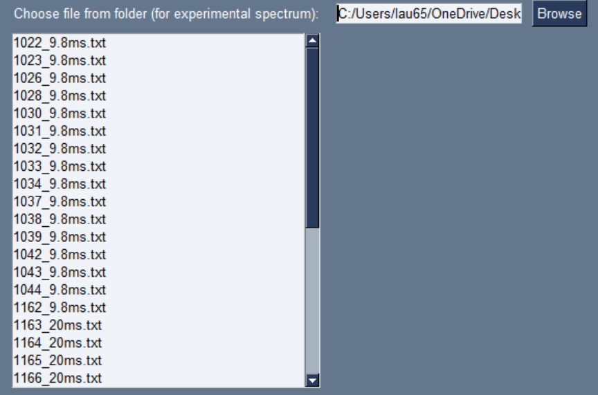
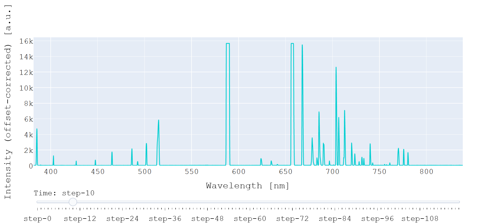
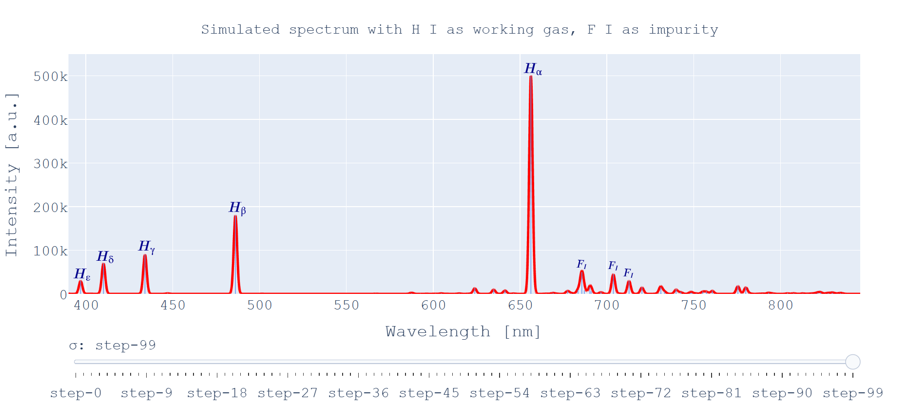
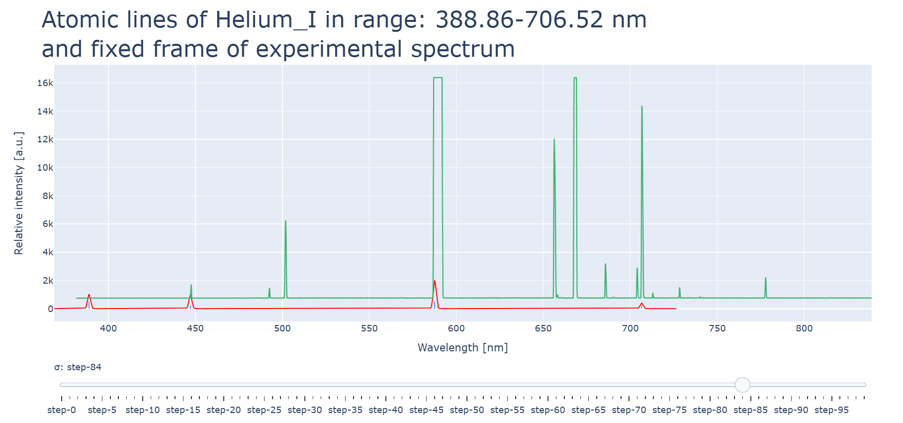

Interactive Spectroscopy – Analysis of Experimental and Simulated Spectra

Author: Laura Lerza  
Technologies Used: Python, PySimpleGUI, NumPy, Plotly  

**Description**

This interactive tool enables the analysis and comparison of experimental optical spectra (multi-frame) acquired from spectrometers with simulated spectra based on theoretical atomic line data (NIST database). It is designed primarily for plasma diagnostics.

---

## 📁 Contents

- [Features](#-features)
- [Requirements](#-requirements)
- [Installation](#-installation)
- [Usage](#-usage)
- [User Guide](#-user-guide)
- [Project Structure](#-project-structure)
- [Contacts](#-contacts)

---

## Features

- **Load Experimental Spectra** from `.txt` or `.csv` files  
- **Simulate Atomic Spectra** using Gaussian convolution  
- **Overlay Experimental and Simulated Spectra**  
-  **Vertical Scale Modes**:
  - Autoscale
  - Normalize
  - Offset Correction  
- **Interactive Plotly Interface** with sliders for:
  - Temporal frame selection
  - Gaussian width (`σ`) variation  
- **Save Outputs** including spectrum data and fit results  
- Cross-platform compatibility using `pathlib`  

---

## Requirements

Install the required packages via pip:

```bash
pip install numpy PySimpleGUI plotly
```

Tested with:

- Python ≥ 3.8  
- NumPy  
- PySimpleGUI  
- Plotly  

---

## Installation

1. Clone this repository:

```bash
git clone https://github.com/your-username/Spectral_GUI.git
cd Spectral_GUI
```

2. Ensure the following are present in the working directory:

- `Spectral_GUI.py` — the main GUI application  
- `Atomic_Lines_NIST` — a folder containing atomic data `.csv` files  
- `Logo_Laura_resized.png` — optional GUI logo file  

---

## Usage

Run the GUI application with:

```bash
python Spectral_GUI.py
```

The interface will open, allowing you to choose files, load data, and generate or compare spectra.

---

## User Guide

### Load Experimental Data



- Use the **Browse** button to select a folder containing `.txt` or `.csv` spectrum files (in this case Ocean_Optics).  
- Select a file from the list that appears.
  
###  Choose Vertical Scaling Mode


- **Autoscale**: Automatic Y-axis range per frame  
- **Normalize**: Normalize each frame to its maximum  
- **Offset-correct**: Shift each frame to zero baseline  

### View Experimental Spectrum

Click **Experimental Spectrum** to:

- Load the selected file  
- Apply wavelength calibration if needed (e.g. Ocean Optics shift)  
- Display an interactive time-series slider  



### Simulate Spectra

Click **Simulated Spectrum** to:

- Open a console input  
- Type one of the following options to select a dataset:

  - `trace1` – Hydrogen_I_normalized_1022  
  - `trace2` – Argon_II  
  - `trace3` – Hydrogen_I  
  - `trace4` – Helium_I  
  - `trace5` – Hydrogen_I_normalized  
  - `trace6` – H_F_He  

- Use the Plotly slider to adjust `σ` (Gaussian width)  
- Simulated lines are plotted in red; original transitions in blue  



### Compare Simulated + Experimental Spectrum

Click **Simulated + Experimental Spectrum** to open a second window with:

- **Fix a frame** — lock one frame from the time series and compare with a simulated dataset  
- **Sum all over the counts** — integrate the entire time series for comparison  
- **Save options** — export calibrated spectra or fitting results  

Use the same `traceX` names as above for simulated datasets.



### Save Output Files

From the secondary window, use:

- **Save calibrated spectrum in a txt file** — to export wavelength + intensity  
- **Save fit data in a txt file** — to export fit results of simulations  

---

## Project Structure

```
Spectral_GUI/
├── Spectral_GUI.py
├── Atomic_Lines_NIST/
│   ├── Hydrogen_I_normalized_1022.csv
│   ├── Argon_II.csv
│   ├── Helium_I.csv
│   ├── Hydrogen_I.csv
│   ├── Hydrogen_I_normalized.csv
│   └── H_F_He.csv
├── Logo_Laura_resized.png
├── images/
│   ├── file_selection.png
│   ├── scaling_modes.png
│   ├── experimental_spectrum.png
│   ├── simulated_spectrum.png
│   └── simulated_plus_experimental.png
└── README.md
```
> mark well: All atomic line `.csv` files are required for simulation features to function properly.


## Contacts

For questions or suggestions, please contact: Laura Lerza->mail:laura.lerza@studio.unibo.it


